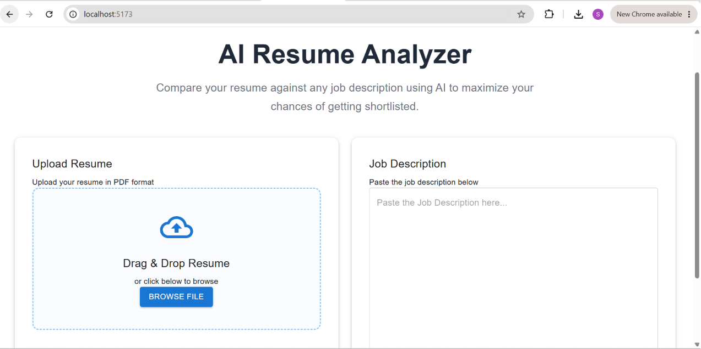
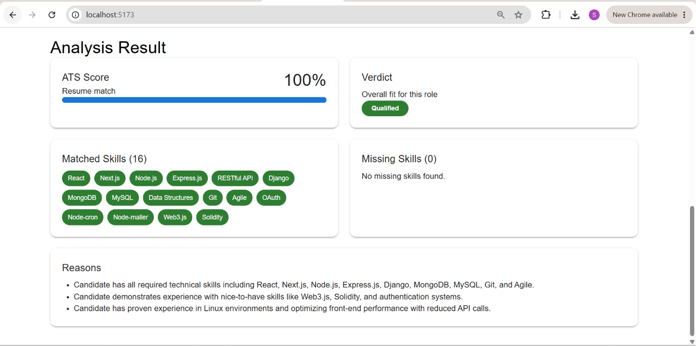

# AI Resume Analyzer - Frontend

A modern React application that analyzes a candidate's resume against a job description using AI. The application allows users to upload a resume, enter a job description, and receive an ATS-style analysis including skill matching, verdict, and improvement suggestions.

## Features

- Upload resume in PDF format
- Enter Job Description
- AI-powered resume analysis
- ATS Match Score
- Qualified / Almost There / Not Yet verdict
- Matched Skills
- Missing Skills
- Improvement Suggestions
- Clean and responsive Material UI interface

## Tech Stack

- React.js
- Material UI (MUI)
- Axios
- React Hooks
- CSS
- Vite

## Project Structure

```
src/
│
├── components/
│   ├── Header.jsx
│   ├── Hero.jsx
│   ├── ResumeForm.jsx
│   ├── UploadCard.jsx
│   ├── JobDescriptionCard.jsx
│   ├── AnalyzeButton.jsx
│   └── AnalysisResult.jsx
│
├── context/
│   └── ResumeContext.jsx
│
├── App.jsx
└── main.jsx
```

## Application Workflow

1. Upload a PDF resume.
2. Enter the Job Description.
3. Click **Analyze Resume**.
4. The frontend sends the resume and job description to the ASP.NET Core backend.
5. The backend extracts resume text, invokes the AI model, and returns the analysis.
6. The frontend displays:
   - ATS Match Score
   - Verdict
   - Matched Skills
   - Missing Skills
   - Reasons

## Installation

Clone the repository

```bash
git clone https://github.com/SabaMahveen/resume-analyzer-ui.git
```

Navigate to the project

```bash
cd resume-analyzer-ui
```

Install dependencies

```bash
npm install
```

Start the development server

```bash
npm run dev
```

The application will be available at:

```
http://localhost:5173
```

## Backend

This frontend communicates with the ASP.NET Core Web API available at:

```
http://localhost:5037
```

Make sure the backend server is running before starting the frontend.

## Screenshots

### Home Page

> 

### Analysis Result

> 

## Future Enhancements

- Drag and Drop Resume Upload
- Export Analysis Report as PDF
- Resume History
- Authentication
- Dark Mode
- Keyword Highlighting
- AI-powered Resume Improvement Suggestions

## Author

**Saba Mahveen**

GitHub: https://github.com/<your-username>

LinkedIn: https://linkedin.com/in/<your-linkedin>
